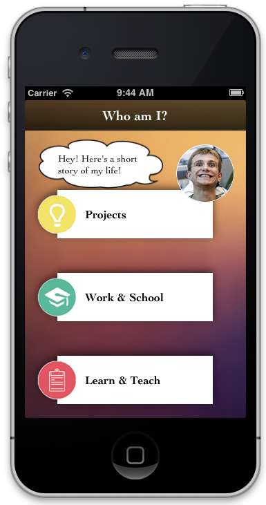
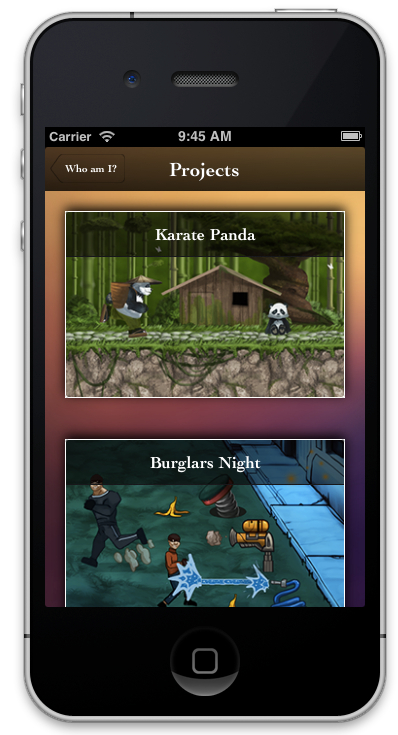
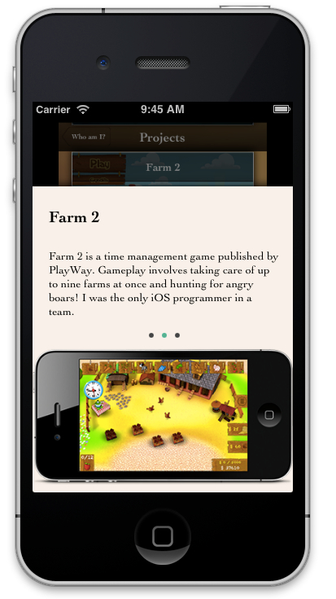
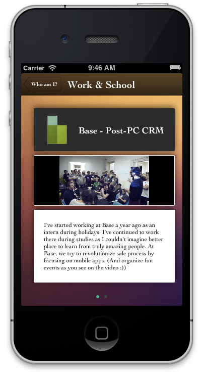

WWDC2013App
===========

App created for WWDC 2013 scholarship application.

***************************

Step by step setup:

1) git clone --recursive git@github.com:Moriquendi/WWDC2013App.git

2) Build and Run Xcode project.

***************************

The app was ment to "tell something about me, highlight my technical skills and intrests".
There was obviously a lot of stress and time pressure during creating this app which makes the app's code pretty ugly in some places. Hopefully, I'll found some time in the future to make the code shine too.

